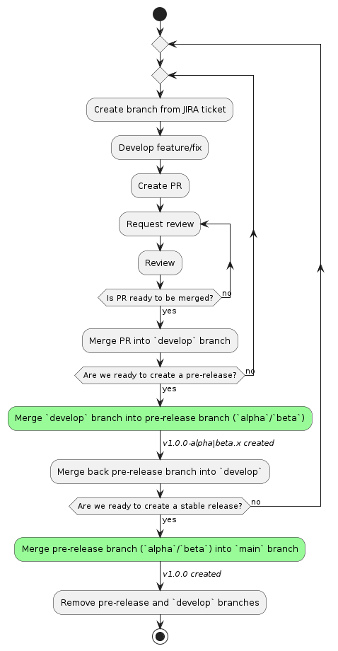
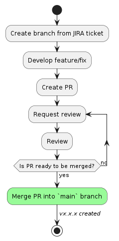

# How to release

## Conventional commits

This repository uses [conventional commits](https://www.conventionalcommits.org/en/v1.0.0/). Each commit messages must be structured as follows:

```
<type>[optional scope]: <description>

[optional body]

[optional footer(s)]
```

For tracking purposes, a Jira issue must be added at the end of the commit message:

```
<type>[optional scope]: <description> [<Jira issue>]
```

Please note that the `commit-msg` hook will not check if a Jira issue is present, but if missing, the commit will be rejected by [Yet Another Commit Checker](https://appfire.atlassian.net/wiki/spaces/YACC/overview) once pushed.

Commit messages form the basis of the publication strategy. They are automatically analysed during the CI/CD process to:

**Important note:** commit messages are the basis of the release strategy. They are automatically parsed during CI/CD process to:
- define the version number of the next release (is it a patch, a minor release or a major release?)
- update the changelog

It is therefore very important **to think about your commit messages** before pushing them to the server, to facilitate communication with our consumers, who are developers used to consulting the changelog when a new version is published.

To help you write better commits, see the tips destion below.

## Semantic release

[semantic-release](https://github.com/semantic-release/semantic-release) is used to handle versioning.

### Workflow

Our workflow should stay as simple as possible and should follow the [release workflow](https://semantic-release.gitbook.io/semantic-release/recipes/release-workflow) of `semantic-release`.

We need to create pre-releases (alpha/beta), at least during the first development phase of the component library, and stable releases for daily updates.
In the future, **we don't want to maintain multiple versions at time** and pre-releases should be avoided as much as possible. 

To summarize:

- [stable releases](https://semantic-release.gitbook.io/semantic-release/recipes/release-workflow/distribution-channels) are the normal way to create daily releases (`main` branch)
- [maintenance releases](https://semantic-release.gitbook.io/semantic-release/recipes/release-workflow/maintenance-releases) should not be used (but it will be possible if one day we need it)
- [pre-releases](https://semantic-release.gitbook.io/semantic-release/recipes/release-workflow/pre-releases) should only be used during first development phase and avoided in the future (`alpha`, `beta` and `rc` branches)

#### During the first development phase (before v1.0.0)



#### Once the first stable version has been released (after v1.0.0)



## Tips to commit on main branch

- Keep in mind that your commit messages are used to generate the changelog
- Commit messages must describe what is the change for the final user (consumer should understand the impact of changes by reading the changelog)
- Pull requests must me squashed (1 Pull request = 1 commit)
- Make a commit for every change, even if it's a minor change
- Do not commit things that are not related to your change (e.g. do not fix something on a component if you are working on another one)
- Do not use `fix` and `feat` commit prefixes if your change does not impact the final user (prefer `chore` or `refactor`, see the [Angular commit message convention](https://github.com/angular/angular/blob/68a6a07/CONTRIBUTING.md#type))
- Add "BREAKING CHANGE" in the body of your commit to create a major release

### Do

```sh
fix: set primary color to black [UXUI-0000]
```

### Don't

```sh
fix: fix styles [UXUI-0000]
```

